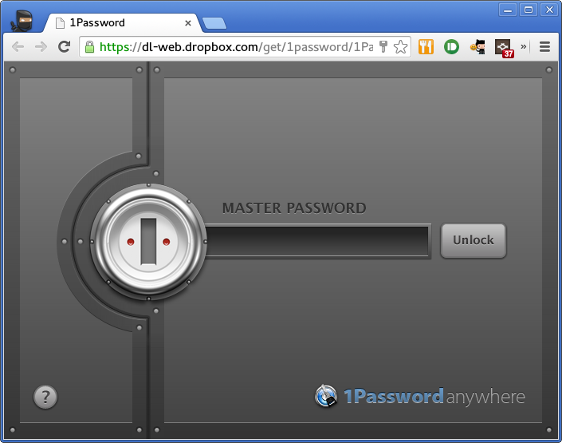

Linux 用の 1Password クライアントが無いと嘆いていたが解決した。

- ブラウザから [Dropbox](https://www.dropbox.com) にアクセス
- Dropbox 内の `1Password/1Password.agilekeychain/1Password.html` をクリック

[参考URL](https://discussions.agilebits.com/discussion/22402/how-to-use-1password-on-linux)
