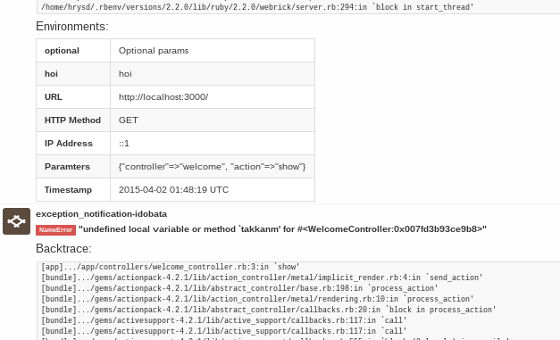

[exception_notification-idobata](https://github.com/hrysd/exception_notification-idobata) を `1.0.0` にアップデートしました。

## なにが変わったの？

メージャーバージョンが上がったからといっても、すごい変わったというわけでなく[brand-new Idobata™](http://blog.idobata.io/post/115181024997) に合わせCSSのクラス名を変更しただけです。

バージョンについては、そこそこまともに動いているのでいつまでも `0.0.n` みたいなのはちょっとな〜と思い `0.0.3` から `1.0.0` にしました。

**イメージ**

## 最後に

皆さん bundle update しましょう！！！！！11
