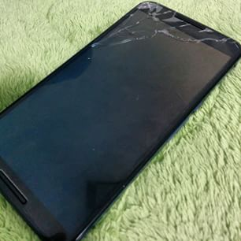
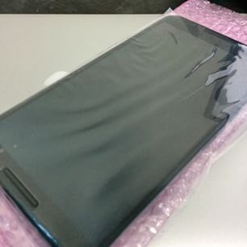

Google Play から買った Nexus6 の画面を割ってしまったので修理しました。

# 割れた

トイレをしようとして、ズボンのポケットから落とした。



# 修理に出す

Google Playで購入していたのでとりあえず[Google Play サポートチーム](https://support.google.com/googleplay/table/6068053)へ連絡。

どこで修理できるか聞くと、修理は製造元のMotorolaで受け付けているとのこと。

Motorolaに電話し、修理したいと伝えると端末のIMEI番号と名前住所等の個人情報、端末の破損状況を聞かれた。

- 落下による破損は保証対象外で有償になる
- 実物をみて見積もりをするので郵送してほしい

とのことで、SIM を抜き取って、工場出荷状態にしてMotorolaから送られてきた箱に詰めて郵送した。

2日くらいで見積もり完了の電話があり、修理してよいか聞かれたので二つ返事でお願いした。

# 帰ってくる

さらに2日くらいたって、綺麗になった Nexus6 が届いた。



# 会計

見積もりに送る送料と修理代で合計17000円くらいだった。

```
| 送料   | 764円   |
| 修理代 | 16295円 |
| 合計   | 17059円 |
```

# 時系列

- 2014/12/30: Nexus 5 の画面を割る
- 2015/01/30: Google Play上で Nexus 6 32GB の在庫が復活していたので購入
- 2015/02/01: Nexus 6 が手元に届く
- 2015/02/11: Nexus 6 の画面を割る
- 2015/02/14: Nexus 6 を修理に出す
- 2015/02/16: 見積がでる
- 2015/02/19: 到着

# 最後に

サポートセンターの対応は早いし、感じも良かったので満足です。

多分、Ymobile で買うとキャリアの保証パックがあって安くなるんだろうな
