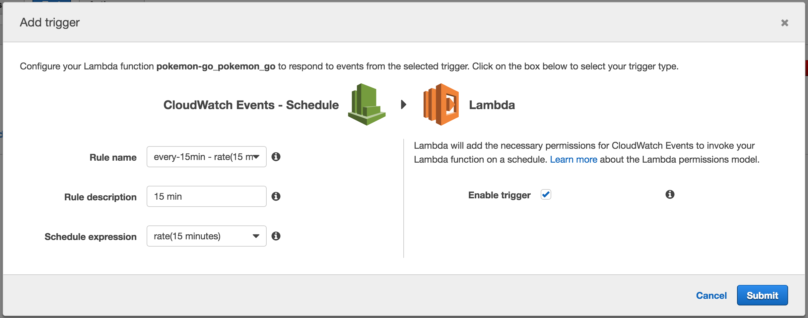

[Pokemon Go](http://www.pokemon.co.jp/ex/PokemonGO/#) のリリースが非常に楽しみなんですが、一日中 Twitter見てるわけにもいかないので、日本の AppStore に Pokemon Go が発表されたらメールするようにしてみた。

## apex

Lambda 関数のビルド、デプロイには [apex/apex](https://github.com/apex/apex) を使用した。

`apex init` でボイラプレートを吐き出してくれたり、IAM のロールを作ってくれたり、デプロイとかもできるので便利だった。

## 関数を作る

Apex ではランタイムとして

- Node.js
- Golang
- Python
- Java

あたりがサポートされていて、Lambda では Node.js の v4.3.2 が使えるので今回はこれを使うことにした。

あと、事前準備として通知には AWS SNS を使用したかったので、 `apex init` 時に作成される IAM のロールで SNS にアクセスできるようポリシーをつけ、SNS にトピックを作成した。

実際の関数は以下。 ES2015 で書いているけど、使用した変換は [transform-es2015-modules-commonjs](http://babeljs.io/docs/plugins/transform-es2015-modules-commonjs/) これだけ。([参考](https://kangax.github.io/compat-table/es6/))

```javascript
import lambda  from 'apex.js';
import AWS     from 'aws-sdk';
import request from 'axios';

AWS.config.region = 'ap-northeast-1';

const SNS       = new AWS.SNS;
const TOPIC_ARN = process.env.TOPIC_ARN;

export default lambda((e, ctx) => {
    return new Promise((resolve, reject) => {
      request
        .get('https://itunes.apple.com/lookup', {params: {id: '1094591345', country: 'jp'}})
        .then((response) => {
          if (response.data.results.length >= 1) {
            const params = {
              Subject: 'Pokemon GO が',
              Message: 'リリースされたぞ!!!',
              TopicArn: TOPIC_ARN
            };

            SNS.publish(params, (err, data) => {
              if (err) {
                reject(err);
                return;
              }

              relsolve(data);
            });
          } else {
            resolve('There are not exists.');
          }
        }).catch((error) => {
          reject(error.data.errorMessage);
        });
  });
});
```

## 定期実行できるようにする

CloudWatch のスケジュールイベントをトリガーに設定した。



## はまった点

#### node\_modules をデプロイに含めたい

`apex init` すると以下のようなにディレクトリが作られる。

```
$ tree
.
├── functions
│   └── pokemon_go
│       └── index.js
└── project.json
```

デプロイ時、 上記の例だと pokemon\_go ディレクトリの中身が対象になり、
例えばプロジェクトのルートで `npm init` した場合、node\_modules がデプロイの対象に含まれない。

解決作としては、関数ごとに `npm init` するのもあれなんで、 browserify を使ってファイルをまとめることにした。

Apex ではデプロイ時のフックが提供されているので、 browserify を叩くようにする。
あわせて、Lambda の環境では aws-sdk-js を特に指定せずとも使用できるので `--exclude` オプションに渡すようにした。

```json
{
  "hooks": {
    "build": "../../node_modules/.bin/browserify --exclude aws-sdk --node -s default -t babelify -o main.js index.js",
    "clean": "rm -f main.js"
  }
}
```

### 環境変数を使用したい

`--set` オプションを使用する。

```
$ apex deploy -s TOPIC_ARN=hogehugapiyo
```

### Terraform インテグレーション

Terraform とのインテグレーションがどうのこうのという記事を見かけたが、

- [Init does'nt ask for Terraform #472](https://github.com/apex/apex/issues/472)
- [refactor project init · apex/apex@f925aca](https://github.com/apex/apex/commit/f925aca68718eb54c2629750e4cf22876372ac7c)

あたりを見る限りでは init 時に作成されなくなったぽいからここはやめて、後回しにした。

## 最後に

用途が違うからなんともという感じだけど、今までこういう時は Heorku で cron という選択肢を取ってばかりだったけど Lambda 便利なのでもっと使って行きたいと思った。(無料枠結構あるし)

> Lambda では 1 か月に 1,000,000 件の無料リクエストおよび 400,000 GB/秒のコンピューティング時間が無料利用枠となっています。Lambda 関数に割り当てたメモリ量によって無料利用枠で実行できる時間が異なります。Lambda の無料利用枠は、12 か月間の AWS 無料利用枠の期間が終了しても自動的に期限切れになることはありません。既存および新規の AWS のお客様は、無期限にご利用いただけます。
